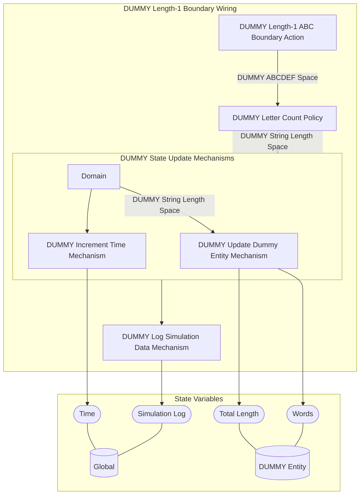

<h1>MSML Template</h1>
The following repository is a template for use in constructing MSML specs. The components in it are marked with DUMMY as they are meant to be replaced but can help in understanding the format of the different pieces.

## The Dummy Model

- The dummy model is meant to show the very basics of functionality but does not have any actual real world use, nonetheless, we will review the components
- The high level idea is that the wirings append different letters to a dummy state the carries an overall string produced over time
- The following are the wiring diagrams of the three wirings which we will then walk through the components of:





- The components are defined as the following:
	- DUMMY Length-1 ABC Boundary Action: Creates a new string to add with length 1 which is either A, B, or C
	- DUMMY Length-2 ABC Combo Boundary Action: Creates a new string to add with length 2 which are combinations of A, B, C
	- DUMMY Length-1 DEF Control Action: Creates a new string of length 1 with either D, E, or F as the value
	- DUMMY Letter Count Policy: The policy which determines the length which equals the string length multiplied by a parameter for amplification of length (this is just to display how parameters work, it wouldn't make sense in the real world)
	- DUMMY Update Dummy Entity Mechanism: Mechanism for updating the dummy local state
	- DUMMY Increment Time Mechanism: Mechanism for updating the global time
	- DUMMY Log Simulation Data Mechanism: Mechanism for appending to the simulation log the current results

## SRC Folder
- All the components in here with the exception of implementations/type mappings are JSON style components that get read into the MSML library for building the specification
    - The MSML documentation details what each type of component is
- Implementations is the folder where Python code can be created to be bound to components
    - For boundary actions, control actions, and policies, the implementations need to have the same name as the different boundary/control/policy options
    - For mechanisms the implementation name should be the same as the mechanism name
    - All will take in state, parameters, and spaces (as a list) and can optionally return spaces (as a list)
- TypeMappings is the folder for mapping the different variable types for different programming languages
    - This allows for translating different typings and spaces across different languages

## Notebooks Folder

There are five notebooks built in which will listed sequentially by what order in which one would be using them based on project timeline

1. Build Obsidian: The notebook for building the Obsidian reports
- The first code block is for loading the spec, it will flag if certain things are broken or not properly connected
- The second code block writes out the Obsidian vault folder as well as the spec tree
- All that is required is the src folder, implementations and the simulation is not needed for this to run
2. Implementation Playground: The notebook for playing with individual blocks
- The first block of code loads functionality and will flag any components which do not have an implementation loaded in
- For this the full src folder including implementations is required (although partial implementations are ok, it will flag which wirings and components can't be run)
- The build_implementation function creates an implementation object that can then be used for executing code
- The prepare_state_and_params function creates a state and parameter to use for running the code, the simulation folder section explains the details more
- The rest of the code blocks show how to run different components and wirings
3. Single Simulation: This notebook is for running one single simulation, especially for testing out if the wirings all work together
- The first code block loads and runs the experiment
- Blocks are defined out by their name and all that one needs to do is write out the sequential queue of blocks that should happen and it can be in any ordering with or without any repeating
- The run_experiment function will run the blocks but needs a post-processing function for defining out how the results should be finalized, state and parameter preperation functions for any pre-processing, and finally optional metrics functions for any simulation level metrics to collect
- The visualizations and data can be played with as shown below
4. Experiment Simulations: The notebook for running a set of experiments
- The experiments are defined within the simulation folder but are brought in here for making the code more legible but one can also write experiments in-line
- The run_experiments function runs similar to the run_experiment function except it is extended to multiple simulations and also can run monte carlo runs
- The second code block is for automated documentation of the starting parameters and starting state taken from the spec components and base state and base parameters
5. Metaprogramming: A work-in-progress piece of MSML, metaprogramming will one day allow for transcription of MSML models to cadCAD models automatically

## Reports Folder

- The reports folder currently just holds one folder which is the obsidian folder
- Opening this folder up in Obsidian allows you to browse through the entire system and all components
- All of the components get refreshed every time you run the "Build Obsidian" notebook so be careful to not write any updates into this

## Simulation Folder

- The simulation folder takes care of all functionality specific to simulations and is broken down into four folders:
1. Config: A folder with all simulation configurations and baseline settings
2. Preprocessing: Any functionality that needs to run directly before simulation runs
3. Postprocessing: A folder with all functionality to run directly after simulations are run including metric computations and final processing into dataframes
4. Analytics: All visualizations and other analytics for analyzing simulations after runs

### Config

- The config folder is made up of 3 modules:
1. State: Dictionaries defining out default starting states which can be used for standardization of different sets of experiments, tests, etc.
2. Params: Dictionaries defining out default parameters for similar purposes as the state
3. Experiment: Definitions for different experiments, each one is keyed into the experiments_map dictionary with a set of blocks to run, a number of monte carlo simulations and optional dictionaries for `State Modifications` and `Param Modifications` which will be used to overwrite default state and default parameters with any attributes passed in for overwriting 

### Preprocessing

- The preprocessing folder has two modules for two types of functions:
1. State Preperation Functions: Functions that take arguments of state and parameters and modify something in the state at run time
    - These functions must return the modified state object
    - These functions are useful for a variety of things such as defining out mappings or filling in state based on another state variable such as filling in a variable of `Number of Entities` based on how many entities are in the starting state passed
2. Parameter Preperation Functions: Functions that take arguments of either just parameters or parameters and state and likewise update the parameter set
    - These functions must return the modified params object
    - An example here is if you have a parameter `Param A` that always has to be 1 - `Param B`, you can have a function that fills it in automatically

### Postprocessing

- The post processing folder has two module:
1. Post: A folder which defines out the post-processing function to execute after each simulation
    - Taking in state and params as arguments, it returns a dataframe which then will have the simulation metadata attatched to it of experiment and monte carlo run automatically
2. Metrics: Functions which add simulation metrics taking as arguments the current metrics dictionary, state, params and the simulation dataframe
    - These functions just need to write a key into the metrics dictionary

### Analytics

- The analytics folder can be broken up however one wants, but creating modules for analytics/visualizations on single runs versus on mutliple runs in experiments can be useful
- These functions are completely as needed/wanted, there is no formal structure other than what works for you

## Tests Folder

- The tests folder shows two interactive notebooks for testing of components and simulations:
1. DUMMY Wiring Test: Simple notebook which shows how one can test component by component and by wiring
2. DUMMY Economic Test: Simple notebook to show how to take an intuition around what a simulation result should look like and test for it

## Model Folder

- The model folder is work-in-progress for metaprogramming and eventually will host all components of a cadCAD model automatically transcribed from an MSML spec
<h2>Specification Tree</h2>

```
├──Entities
│   ├──DUMMY Entity
│   ├──Global
├──State
│   ├──DUMMY State
│   │   ├──Words
│   │   ├──Total Length
│   ├──Global State
│   │   ├──Dummy
│   │   ├──Time
│   │   ├──Simulation Log
├──Stateful Metrics
│   ├──DUMMY Stateful Metrics
│   │   ├──DUMMY Nominal Length Stateful Metric
├──Types
│   ├──DUMMY ABCDEF Type
│   ├──DUMMY Integer Type
│   ├──DUMMY Decimal Type
│   ├──Entity Type
│   ├──Simulation Log Type
├──Spaces
│   ├──Terminating Space
│   ├──Empty Space
│   ├──DUMMY ABCDEF Space
│   ├──DUMMY String Length Space
├──Parameters
│   ├──DUMMY Parameter Set
│   │   ├──DUMMY D Probability
│   │   ├──DUMMY Length Multiplier
├──Boundary Actions
│   ├──DUMMY Length-1 ABC Boundary Action
│   ├──DUMMY Length-2 ABC Combo Boundary Action
├──Control Actions
│   ├──DUMMY Length-1 DEF Control Action
├──Policies
│   ├──DUMMY Letter Count Policy
├──Mechanisms
│   ├──DUMMY Update Dummy Entity Mechanism
│   ├──DUMMY Increment Time Mechanism
│   ├──DUMMY Log Simulation Data Mechanism

```