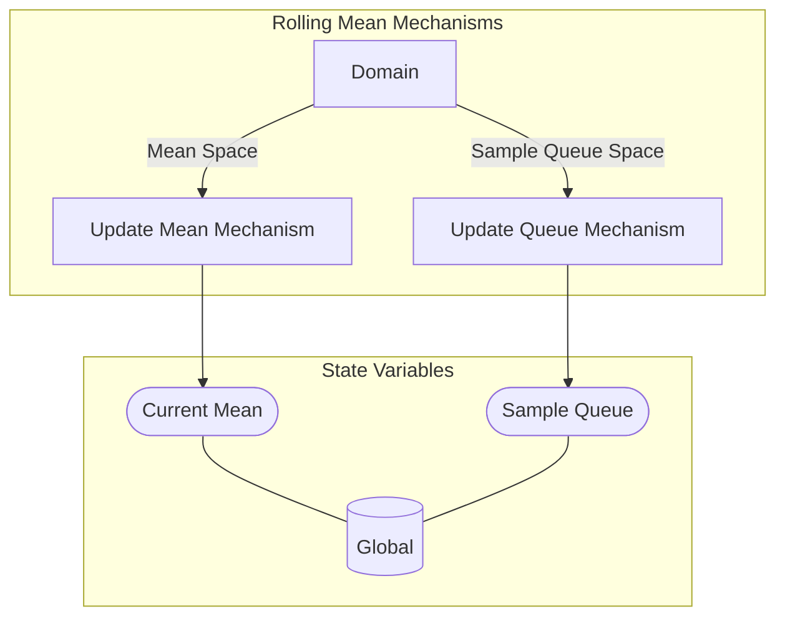

## Wiring Diagram

## Description

Block Type: Parallel Block
Mechanisms for Rolling Mean Update
## Components
1. [[Update Mean Mechanism]]
2. [[Update Queue Mechanism]]

## All Blocks
1. [[Update Mean Mechanism]]
2. [[Update Queue Mechanism]]

## Constraints

## Domain Spaces
1. [[Mean Space]]
2. [[Sample Queue Space]]

## Codomain Spaces
1. [[Empty Space]]

## All Spaces Used
1. [[Empty Space]]
2. [[Mean Space]]
3. [[Sample Queue Space]]
4. [[Terminating Space]]

## Parameters Used

## Called By

## Calls

## All State Updates
1. [[Global]].[[Global State-Current Mean|Current Mean]]
2. [[Global]].[[Global State-Sample Queue|Sample Queue]]

