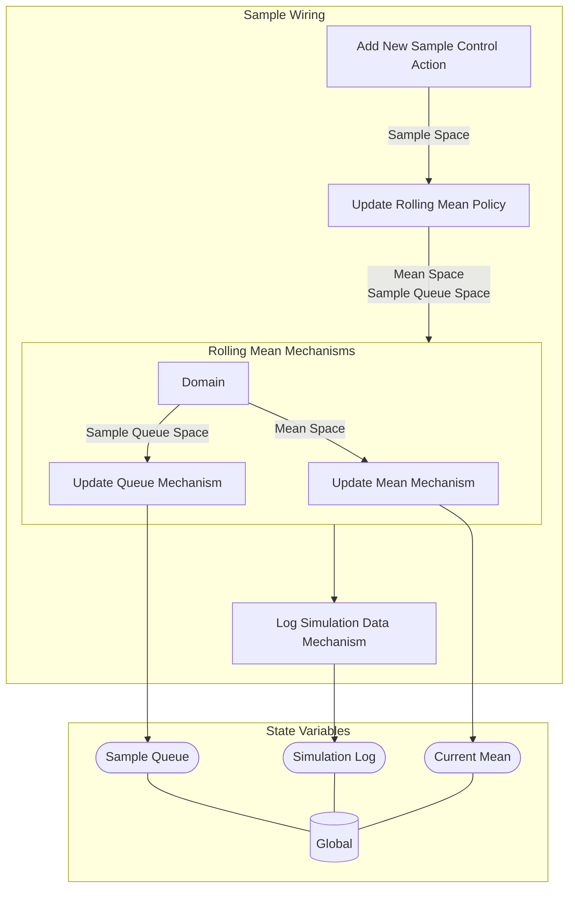

## Wiring Diagram

## Description

Block Type: Stack Block
A block for sampling and updating a rolling mean
## Components
1. [[Add New Sample Control Action]]
2. [[Update Rolling Mean Policy]]
3. [[Rolling Mean Mechanisms]]
4. [[Log Simulation Data Mechanism]]

## All Blocks
1. [[Add New Sample Control Action]]
2. [[Log Simulation Data Mechanism]]
3. [[Update Mean Mechanism]]
4. [[Update Queue Mechanism]]
5. [[Update Rolling Mean Policy]]

## Constraints

## Domain Spaces
1. [[Empty Space]]

## Codomain Spaces
1. [[Terminating Space]]

## All Spaces Used
1. [[Empty Space]]
2. [[Mean Space]]
3. [[Sample Queue Space]]
4. [[Sample Space]]
5. [[Terminating Space]]

## Parameters Used
1. [[Rolling Mean Window]]
2. [[Sample Mean]]
3. [[Sample Standard Deviation]]

## Called By

## Calls

## All State Updates
1. [[Global]].[[Global State-Current Mean|Current Mean]]
2. [[Global]].[[Global State-Sample Queue|Sample Queue]]
3. [[Global]].[[Global State-Simulation Log|Simulation Log]]

